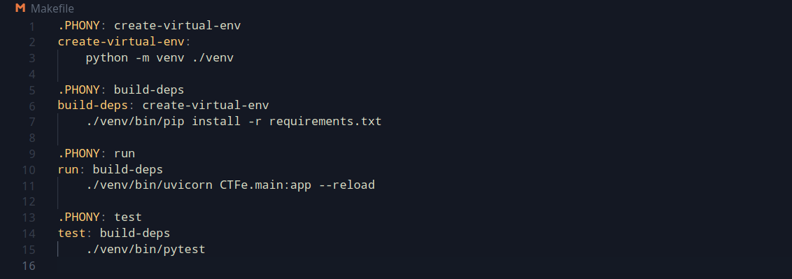
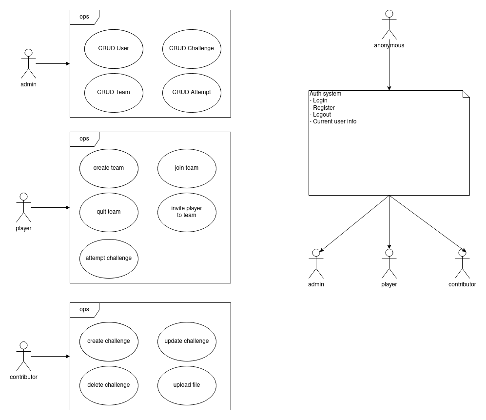
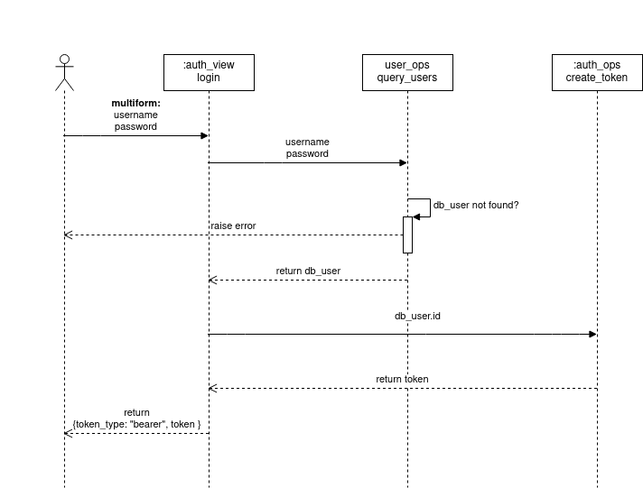
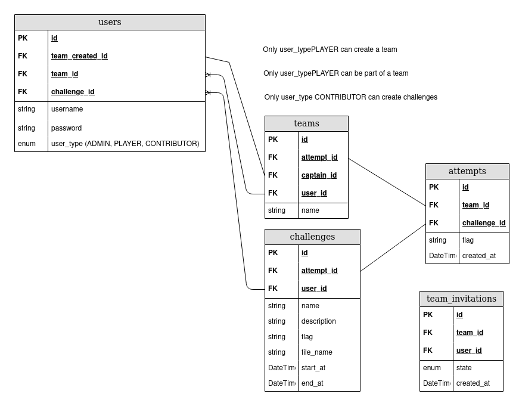

# CTFe

A Rest API which provides a backend for a Capture The Flag platform.

The API is written in Python and FastAPI, and uses PostgreSQL as backend.

It has the following features:

- Authentication with username and password.

- JWT tokens.

- Models for players, contributors (who can create and publish challenges), and admins.

- The challenges can have files attached to them.

- Ready to use database migration tool - Alembic.

- Ready to use async unit testing - pytest.

## To run the application (on Linux)

The first file to look into when running the application will be the **Makefile** in the root directory.



To run the application:

1. Create a virtual environment

```
    make create-virtual-env
```

2. Install the dependencies

```
    make build-deps
```

3. Run the package from the root directory

```
    make run
```

4. Run the unit tests

```
    make test
```

You could also skip the first and second steps and directly execute `make run`, or `make test`.

The commands `make run` and `make test` will automatically create the virtual environment, and install the dependencies (if needed).

## Use Case Schema



## Authentication Flow Schema



## Database Schema



## API routes

To see all the available routes run the application `make run`, and navigate to **/docs** (e.g. http://localhost:8000/docs)
